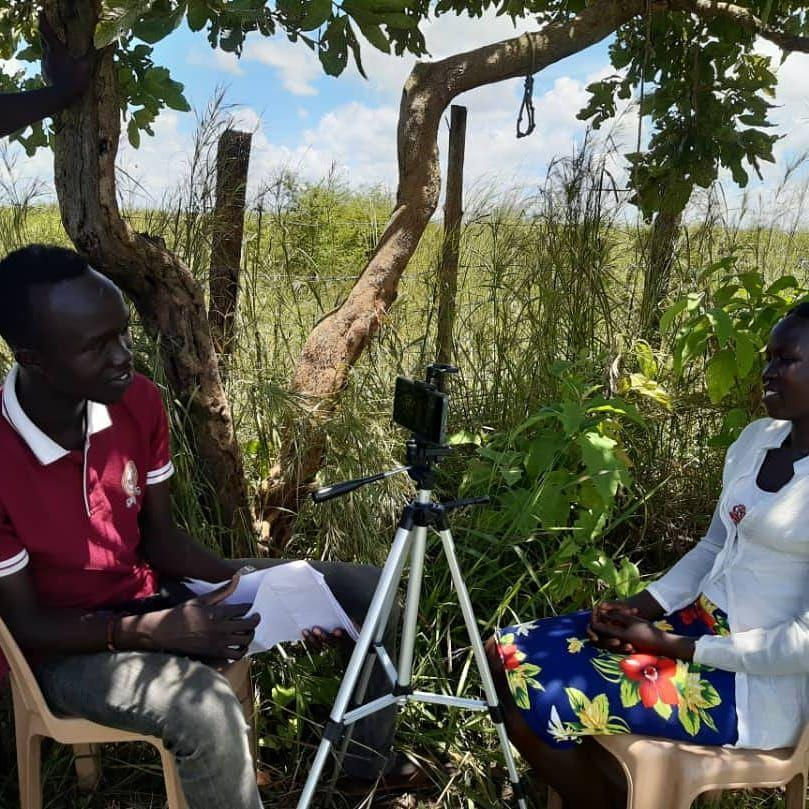

# #ASKnet LEAD - the Local Expert Action Directory
The aim of this project is to collect stories and skills of #ASKnet members to act or pave way as an inspiration about the importance of tech and other developmental skills for the socio-economic development of their communities. *ASKnet - Access to Skills and Knowledge network*

The project carries or calls independent stories of experts, and shall be collected and documented for future reference in community inspiration and empowerment.

The local expertise can lead to trainings, collaboration, gatherings and much more. Feel free to contact any of the peers in your region or [suggest another profile](https://github.com/ASKnetCommunity/LEAD/issues) to be added. You might also want to contact one of the partner Hubs for participation.

If you want to take part, you can start with creating a profile for yourself. You [find the tutorials here](https://github.com/ASKnetCommunity/LEAD/wiki). 

## Credits

This project was started by Gilbert and the Community members around #ASKnet [Track-II-participants Stories for Community-Empowerment 2020-2021](https://github.com/ASKnet-Open-Training/ASKnet-Track-II-participants-stories-Community-Empowerment-2020-2021/) - Special thx to all the mentors who helped create it, we will continue the work with a new direction called LEAD - **Local Expert Action Directory** where you can find the local expertise around you, provided by the [#ASKnet](https://openculture.agency/asknet-access-to-skills-and-knowledge-network/) Community
