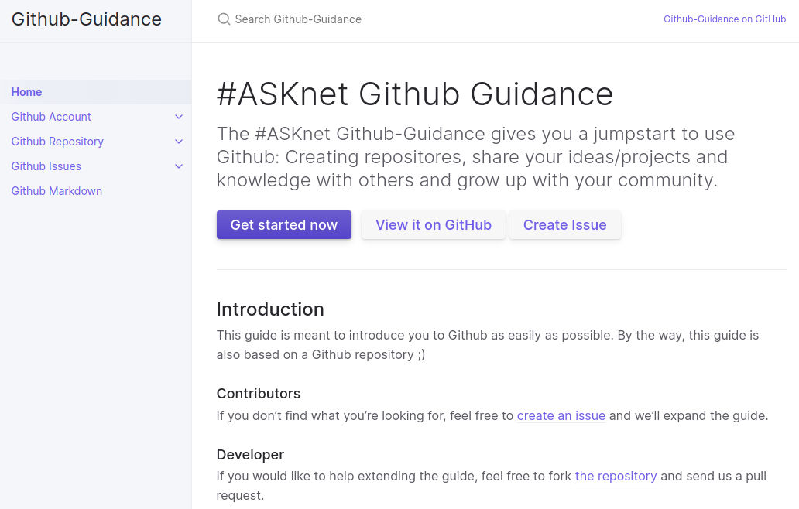

<a href="https://github.com/bmen"><i class="fab fa-github"></i></a> <a href="https://bmen.cc"><i class="fas fa-home"></i></a> <a href="https://t.me/b_men"><i class="fab fa-telegram"></i></a>

I have been a freelance web designer and DevOp for over 15 years. I support different clients and projects. From a simple website, over Git architectures to complex IT systems.

I joined the #ASKnet program in 2018 and initially worked on the #ASKotec case. Until I realized how big the #ASKnet network is and how many wonderful people are working there. Now I am involved in many projects and you can [see some of them below](#projects). 

### Skills

  
Interfacedesign (HTML4 and CSS3)

  
Conceptual design for Git projects

  
Database design and concept

  
Build and deployment processes

  
Communitacion (E-Mail & Telegram)

---

### Projects

#### #ASKotec Case

#ASKotec; the Access to Skills and Knowledge Open Tech Emergency Case is a resource kit for community trainers.

My tasks: interior layout, building #ASKmods and documentation

<a class="btn btn-primary btn-sm" href="https://github.com/opencultureagency/ASKotec" role="button"><i class="fab fa-github"></i> Github Project</a> <a class="btn btn-primary btn-sm" href="https://askotec.openculture.agency/" role="button"><i class="fas fa-home"></i> Website</a>

---

#### #ASKotec Website

The official website of the #ASKotec Case, were you can find all information about it.

My tasks: database, cms, front-end design and development

<a class="btn btn-primary btn-sm" href="https://github.com/opencultureagency/ASKotec-Website" role="button"><i class="fab fa-github"></i> Github Project</a> <a class="btn btn-primary btn-sm" href="https://askotec.openculture.agency/" role="button"><i class="fas fa-home"></i> Website</a>

---

#### #ASKnet Github Guidance

The #ASKnet Github-Guidance gives you a jumpstart to use Github.

My tasks: jekyll and gihtub page development, creating templates and manuals

<a class="btn btn-primary btn-sm" href="https://github.com/ASKnet-Open-Training/Github-Guidance" role="button"><i class="fab fa-github"></i> Github Project</a> <a class="btn btn-primary btn-sm" href="https://asknet-open-training.github.io/Github-Guidance" role="button"><i class="fas fa-home"></i> Website</a>

---

#### #ASKtraining

With the #ASKnet training plan you can compile and plan your individual training.

my tasks: project management, interface design, concept

<a class="btn btn-primary btn-sm" href="https://github.com/ASKtraining/Training" role="button"><i class="fab fa-github"></i> Github Project</a> <a class="btn btn-primary btn-sm" href="https://asktraining.github.io/Training/" role="button"><i class="fas fa-home"></i> Website</a>

---

#### #ASKnet Track II Stories

A hall of fame from all participants and trainers for the track II training 2020/21

my tasks: jekyll and gihtub page development, creating templates

<a class="btn btn-primary btn-sm" href="https://github.com/ASKnet-Open-Training/ASKnet-Track-II-participants-stories-Community-Empowerment-2020-2021" role="button"><i class="fab fa-github"></i> Github Project</a> <a class="btn btn-primary btn-sm" href="https://asknet-open-training.github.io/ASKnet-Track-II-participants-stories-Community-Empowerment-2020-2021/" role="button"><i class="fas fa-home"></i> Website</a>

---
